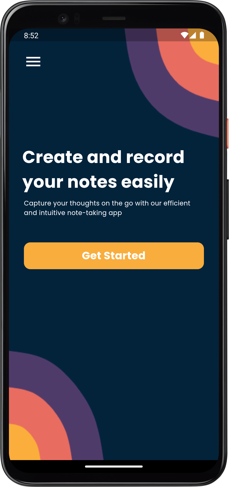
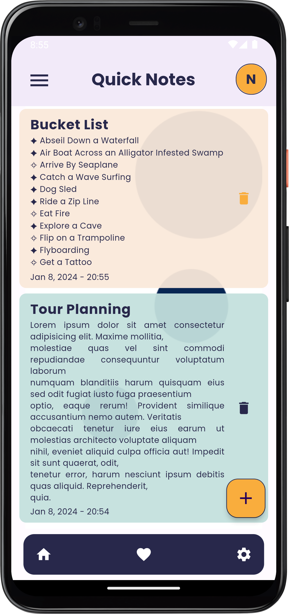
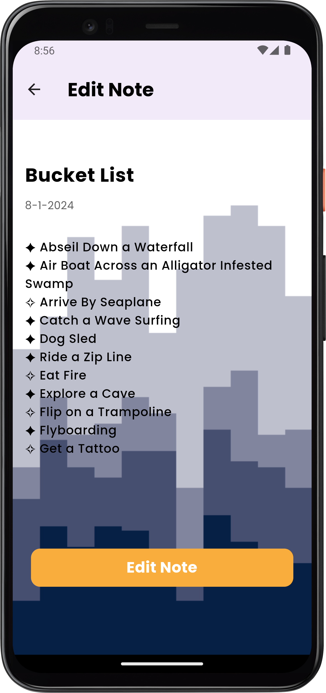
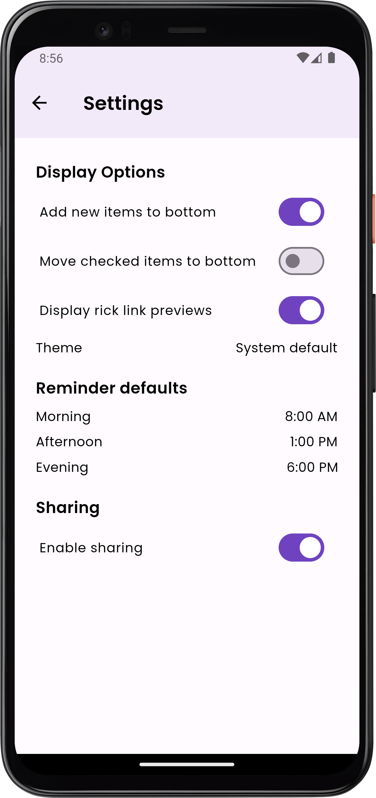

  

# Quick Notes

"Quick Notes" is a Flutter-based note-taking app designed for simplicity and efficiency. With a clean interface and powerful features, it provides a seamless experience for users to capture thoughts on the go.

## Key Features

- **Effortless Note-Taking:** Quickly jot down your thoughts and ideas.
- **Rich Text Formatting:** Enhance your notes with bold, italics, and more.
- **Image Support:** Attach images to your notes for visual reference.
- **Responsive Design:** Enjoy a consistent experience across various devices.
- **Intuitive UI:** User-friendly interface for smooth navigation.

## Screenshots

  
  &nbsp; &nbsp; &nbsp; &nbsp; &nbsp;
  

*Start Screen: Begin your note-taking journey with Quick Notes' clean and inviting start screen.*

*Home Screen: Easily manage and access your notes on Quick Notes' intuitive and organized home screen.*

### Add Screen

  
  &nbsp; &nbsp; &nbsp; &nbsp; &nbsp;
  

*Add Screen: Seamlessly create and edit your notes with Quick Notes' user-friendly interface.*

*Settings Screen: Personalize your Quick Notes experience with customizable settings.*

## Technologies Used

- Flutter: The app is developed using the Flutter framework.
- Google Fonts: Utilizes Google Fonts for a modern and readable typography style.
- SharedPreferences: Manages local storage for persistent data.
- Provider: Implements state management for efficient app-wide data sharing.

## Getting Started

To get started with "Quick Notes," follow these simple steps:
1. Clone the repository.
2. Install dependencies using `flutter pub get`.
3. Run the app with `flutter run`.

Explore the world of effortless note-taking with "Quick Notes"!
